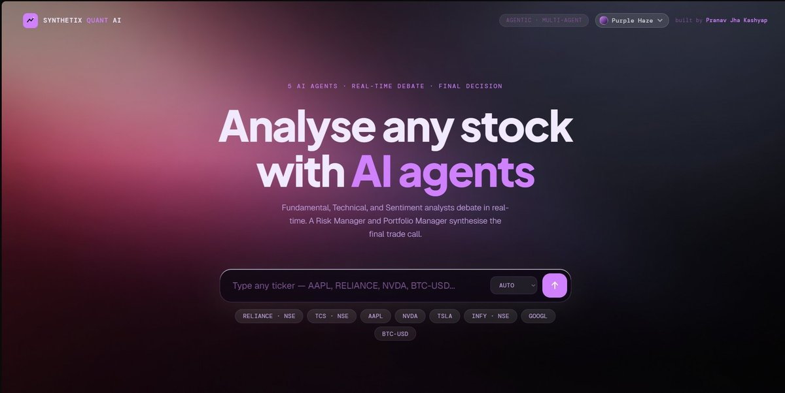
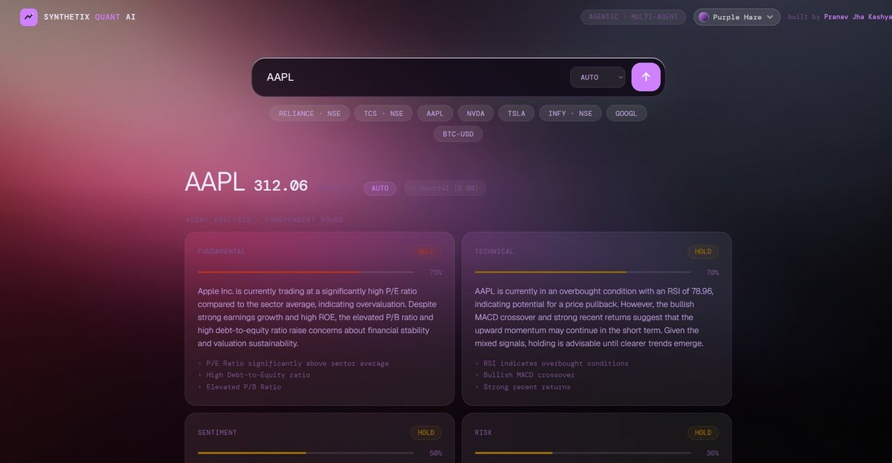
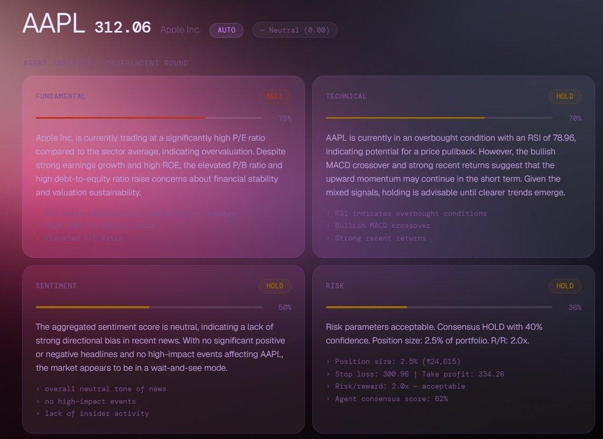
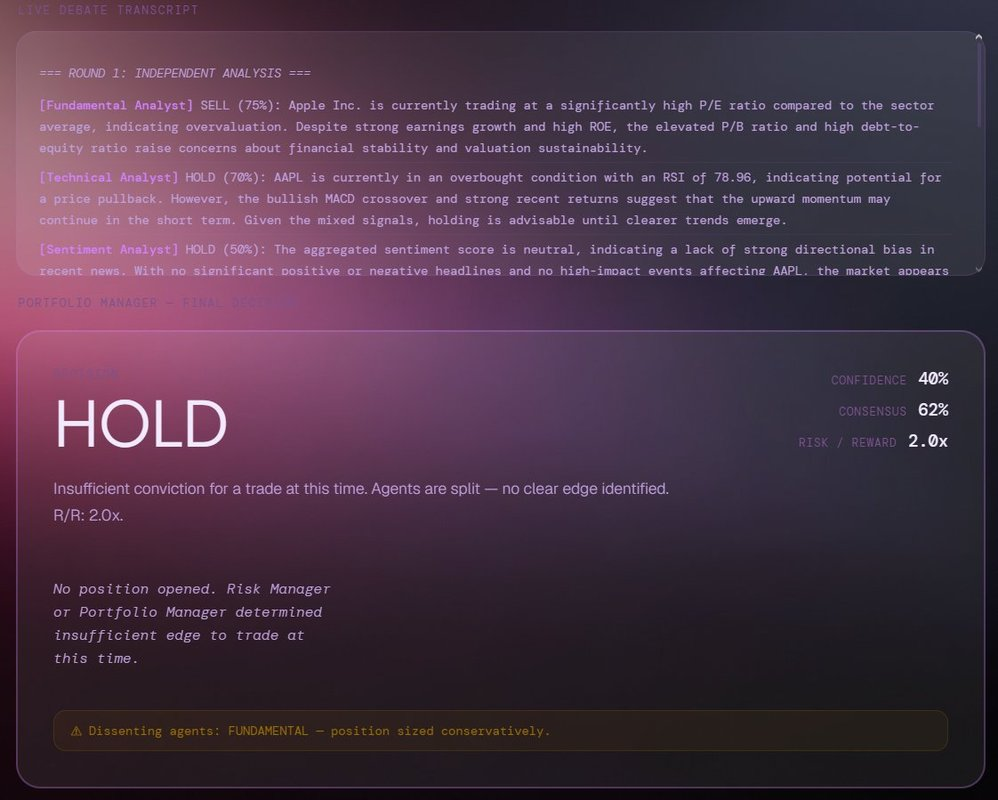

# Synthetix Quant AI — Agentic Trading Framework

> **5 specialized AI agents debate market signals in real-time. A Portfolio Manager synthesises the final trade decision.**



[](https://python.org)
[](https://flask.palletsprojects.com)
[](https://openai.com)
[](LICENSE)

---

## What It Does

Synthetix Quant AI mirrors how a real trading desk operates. Instead of a single model making a prediction, **five independent AI agents each analyse the same stock from a different lens**, argue their case, and a Portfolio Manager makes the final call — with full transparency.

**Analyse any stock in the world.** NSE stocks, NASDAQ, NYSE, crypto, indices.

---

## Live Demo

**[synthetix-quant-ai.vercel.app](https://synthetix-quant-ai.vercel.app)**

---

## System Architecture

```
┌─────────────────────────────────────────────────────────┐
│                    USER INPUT                           │
│              Ticker + Exchange (e.g. AAPL)              │
└──────────────────────┬──────────────────────────────────┘
                       │
                       ▼
┌─────────────────────────────────────────────────────────┐
│               MARKET DATA LAYER                         │
│   Yahoo Finance API → OHLCV + Fundamentals + News       │
│   Indicators: RSI · MACD · Bollinger · ATR · Volume     │
└──────────┬────────────────────────────────┬─────────────┘
           │                                │
           ▼                                ▼
┌──────────────────────┐      ┌─────────────────────────┐
│  FUNDAMENTAL ANALYST │      │   TECHNICAL ANALYST     │
│  P/E · EPS Growth    │      │   RSI · MACD · BB       │
│  ROE · FCF · Margins │      │   Momentum · Volume     │
│  Valuation vs Sector │      │   Support/Resistance    │
└──────────┬───────────┘      └────────────┬────────────┘
           │                               │
           ▼                               ▼
┌──────────────────────┐      ┌─────────────────────────┐
│  SENTIMENT ANALYST   │      │      RISK MANAGER       │
│  News Scoring        │      │   Position Sizing       │
│  Headline Analysis   │      │   Drawdown Limits       │
│  Market Mood         │      │   R/R Ratio · VETO      │
└──────────┬───────────┘      └────────────┬────────────┘
           │                               │
           └──────────────┬────────────────┘
                          ▼
           ┌──────────────────────────────┐
           │      DEBATE ROUND            │
           │  Agents see each other's     │
           │  signals and argue back      │
           └──────────────┬───────────────┘
                          ▼
           ┌──────────────────────────────┐
           │     PORTFOLIO MANAGER        │
           │  Weighted signal synthesis   │
           │  Final: BUY/SELL/HOLD        │
           │  Entry · Stop · Target · R/R │
           └──────────────────────────────┘
```

---

## Agent Roles

| Agent | Analyses | Signal Weight |
|-------|----------|--------------|
| **Fundamental Analyst** | P/E, EPS growth, ROE, FCF, debt levels | 30% |
| **Technical Analyst** | RSI, MACD, Bollinger Bands, price momentum | 30% |
| **Sentiment Analyst** | News flow, headline scoring, market mood | 15% |
| **Risk Manager** | Position sizing, drawdown, R/R ratio — **has veto power** | 25% |
| **Portfolio Manager** | Final arbitrator — weighs all signals | Final call |

---

## Screenshots

### Agents Analysing Independently


### Live Debate Transcript + Agent Cards


### Portfolio Manager — Final Decision


---

## Technical Stack

**Backend**
- Python 3.10 · Flask · Gunicorn
- OpenAI GPT-4o-mini for agent reasoning
- Yahoo Finance API for live market data
- Custom indicator engine — RSI, MACD, Bollinger Bands, ATR (zero numpy dependency)
- Multi-agent debate loop with confidence-weighted signal synthesis

**Frontend**
- Vanilla HTML/CSS/JS — single file, no framework
- Plus Jakarta Sans · DM Mono typography
- 4 dynamic themes (Cyan Wave, Purple Haze, Solar Flare, Neon Arc)
- Fully responsive — mobile + desktop

**Deployment**
- Frontend: Vercel
- Backend: Render / HuggingFace Spaces

---

## Features

- **Any ticker worldwide** — NSE, NASDAQ, NYSE, BSE, crypto (BTC-USD), indices
- **Real-time live data** — prices, fundamentals, and news via Yahoo Finance
- **Multi-agent debate** — agents see each other's signals and argue before the PM decides
- **Risk Manager veto** — trade is blocked if R/R ratio is below threshold
- **Full transparency** — live debate transcript, confidence bars, dissent tracking
- **4 visual themes** — persistent via localStorage
- **Rule-based fallback** — works without API key using pure financial heuristics

---

## Local Setup

```bash
# 1. Clone
git clone https://github.com/PranavJhaZ/Synthetix-Quant-AI
cd Synthetix-Quant-AI

# 2. Install
pip install -r requirements.txt

# 3. Set API key (PowerShell)
$env:OPENAI_API_KEY="sk-proj-..."

# 4. Run
python api/server.py

# 5. Open
# http://localhost:7860
```

**Supported tickers:**
```bash
# NSE stocks
python main.py --ticker RELIANCE --exchange NSE

# US stocks (auto-detected)
python main.py --ticker AAPL
python main.py --ticker NVDA

# Crypto
python main.py --ticker BTC-USD
```

---

## Project Structure

```
Synthetix-Quant-AI/
├── agents/
│   ├── base_agent.py          # Abstract base — LLM + rule-based fallback
│   ├── fundamental_analyst.py # P/E, EPS, ROE, FCF analysis
│   ├── technical_analyst.py   # RSI, MACD, Bollinger, momentum
│   ├── sentiment_analyst.py   # News scoring, headline NLP
│   ├── risk_manager.py        # Position sizing, veto logic
│   └── portfolio_manager.py   # Final weighted decision
├── core/
│   ├── orchestrator.py        # 4-phase debate loop manager
│   └── signal.py              # Typed data models (AgentSignal, TradeDecision)
├── tools/
│   └── indicators.py          # RSI, MACD, BB, ATR — pure Python, no numpy
├── data/
│   ├── market_data.py         # Yahoo Finance live data fetcher
│   └── mock_market_data.py    # Offline GBM-based mock data
├── config/
│   └── settings.py            # Risk params, agent configs, LLM settings
├── api/
│   └── server.py              # Flask REST API
├── index.html                 # Full frontend — single file
└── main.py                    # CLI entry point
```

---

## API Reference

```http
POST /analyze
Content-Type: application/json

{ "ticker": "AAPL", "exchange": "" }
```

Response includes: `direction`, `confidence`, `signals[]`, `debate_transcript[]`, `levels` (entry/stop/target), `position` sizing, `meta.consensus_score`.

```http
GET /health          → {"status": "ok"}
GET /snapshot/AAPL   → live indicators + fundamentals + news
```

---

## Roadmap

- [ ] AutoGen integration for real multi-agent message passing
- [ ] Backtesting engine — test signals on historical data
- [ ] Portfolio tracker — track all past decisions
- [ ] WebSocket live streaming of agent debate
- [ ] FinBERT sentiment model for deeper news analysis
- [ ] Options chain analysis agent

---

## Built By

**Pranav Jha Kashyap** — B.Tech 2029  
AI × Finance · Working toward quantitative AI engineering

---

*Built with Python, Flask, OpenAI, and a lot of market data.*
